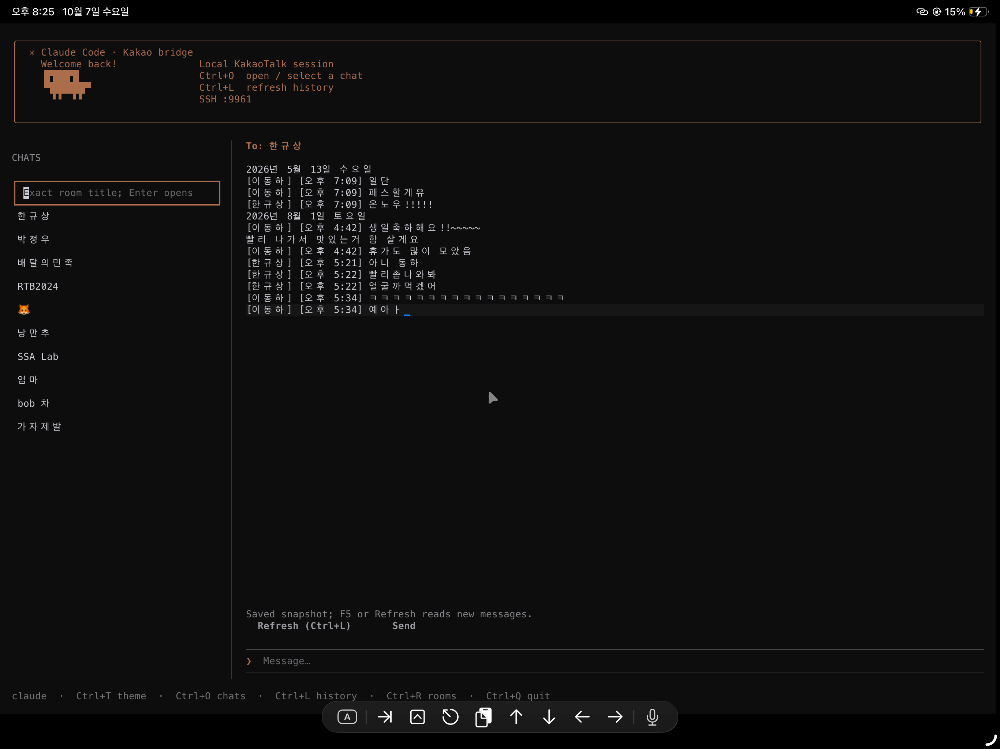
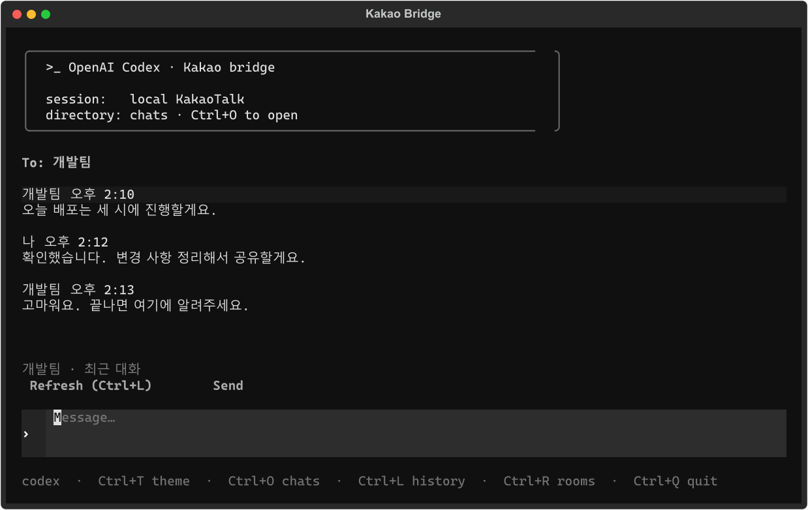
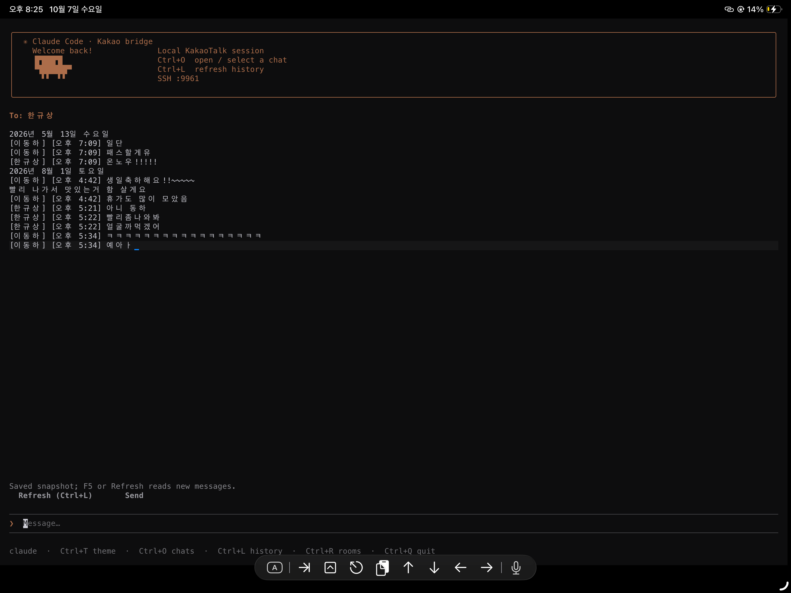

# Kakao in Codex

**SSH로 집에 켜 둔 카카오톡을 제어하세요. 어디서든 터미널 하나로.**

집의 Windows PC에 카카오톡을 로그인해 두고, 밖에서는 SSH로 접속하면 됩니다. 회사 노트북에서도, 폰에서도 채팅방을 열고 대화를 읽고 답장을 보낼 수 있습니다.

업무 중 눈치 안 보고 카톡하는 방법이기도 합니다.

검은 화면에 글자가 쭉 올라가면 일단 열심히 일하는 것처럼 보입니다. Codex와 Claude를 닮은 터미널에서 친구에게 답장하세요. 오늘의 코드는 카톡입니다.

카카오톡 로그인은 PC 클라이언트가 처리하고, Windows 에이전트가 채팅창을 읽고 조작합니다. SSH 서버와 터미널 화면은 Docker에서 실행합니다.



[동작 영상 보기](docs/media/demo.mp4) — 이름과 시간은 남기고 대화 본문만 모자이크 처리했습니다. 영상은 2배속입니다.

<details>
<summary>테마별 화면</summary>

| Codex | Claude |
| --- | --- |
|  |  |

</details>

## 준비

- Windows와 로그인된 PC 카카오톡
- Docker Desktop, Linux 컨테이너 모드
- Python 3.10과 Python Launcher (`py`)
- Windows OpenSSH 클라이언트

## 설치

릴리스 ZIP을 풀거나 저장소를 내려받은 뒤, **카카오톡이 실행 중인 Windows 데스크톱**에서 PowerShell을 엽니다.

```powershell
.\scripts\setup.ps1 -Clipboard
ssh -t -p 9961 -i .\secrets\id_ed25519 kakao@localhost
```

설치 스크립트는 Python 환경, 접속 키, 중계 토큰을 만들고 컨테이너와 에이전트를 시작합니다. 기존 키와 토큰은 유지합니다. 에이전트는 Windows 서비스나 SSH 세션이 아닌 로그인된 사용자의 GUI 세션에서 실행해야 합니다.

SSH는 기본적으로 `0.0.0.0:9961`에 열립니다. PC 내부 접속만 허용하려면 다음과 같이 설치합니다.

```powershell
.\scripts\setup.ps1 -Clipboard -LocalOnly
```

다른 기기에서는 `localhost` 대신 Windows PC 주소를 사용합니다. 방화벽과 공유기 설정은 직접 해야 합니다. 개인 키 `secrets/id_ed25519`는 접속할 기기에만 복사하고 저장소에 올리지 마세요.

## TUI

| 키 | 동작 |
| --- | --- |
| Ctrl+O | 채팅방 검색·목록 열기/닫기 |
| Ctrl+L | 현재 대화 새로고침 |
| Ctrl+R | 채팅방 목록 갱신 |
| Ctrl+T | Codex/Claude 테마 전환 |
| Enter | 검색창에서는 방 열기, 메시지 입력창에서는 송신 |
| Ctrl+Q | 종료 |

Ctrl+O를 누르고 정확한 방 이름을 입력하거나 목록에서 방을 선택합니다. 선택·열기·송신 후에는 대화를 다시 읽습니다. 감지된 알림은 목록의 `noti`로 표시하며, 현재 방에 새 알림이 오면 자동 갱신합니다.

테마 선택은 다음 SSH 접속에도 유지됩니다. 접속할 때 직접 지정할 수도 있습니다.

```powershell
ssh -t -p 9961 -i .\secrets\id_ed25519 kakao@localhost kakao tui --theme claude
```

## CLI

```powershell
ssh -p 9961 -i .\secrets\id_ed25519 kakao@localhost kakao health
ssh -p 9961 -i .\secrets\id_ed25519 kakao@localhost kakao chats
ssh -p 9961 -i .\secrets\id_ed25519 kakao@localhost 'kakao open "개발팀"'
ssh -p 9961 -i .\secrets\id_ed25519 kakao@localhost 'kakao read "개발팀" --refresh -n 50'
ssh -p 9961 -i .\secrets\id_ed25519 kakao@localhost 'kakao send "개발팀" "확인했습니다"'
ssh -p 9961 -i .\secrets\id_ed25519 kakao@localhost 'kakao watch "개발팀"'
```

`read`는 저장된 내역을, `read --refresh`는 현재 채팅창을 읽습니다. `-n`은 메시지 수가 아니라 텍스트 줄 수입니다. `watch`는 저장된 내역이 바뀔 때 출력하며 직접 주기적으로 창을 복사하지 않습니다.

동명 방은 `chats`가 반환한 창 ID로 지정합니다. 이 ID는 카카오톡 서버의 room ID가 아니며 창을 다시 열면 바뀝니다.

## 구성

```text
SSH client ── :9961 ── Docker SSH / TUI / relay
                                         ↑
Windows GUI agent ── 127.0.0.1:9962 ───────┘
        ↓
    KakaoTalk.exe
```

SSH는 키 로그인과 정해진 `kakao` 명령만 허용합니다. 일반 셸·root·비밀번호 로그인·포트 포워딩은 차단합니다. HTTP 중계는 Windows loopback에만 공개하고 토큰으로 인증합니다. 메시지 내역과 요청 결과는 메모리에 보관하며, 재시작하면 초기화됩니다.

카카오톡 프로토콜·인증을 재구현하지 않으며 프로세스 주입·DB 복호화·인증정보 추출을 사용하지 않습니다. 구조와 개발 방법은 [CONTRIBUTING.md](CONTRIBUTING.md)에 정리했습니다.

## 관리

```powershell
.\scripts\diagnose.ps1
.\scripts\stop.ps1 -AgentOnly
.\scripts\start-agent.ps1 -Clipboard
.\scripts\stop.ps1
```

진단 출력에는 방 이름·프로세스 경로·네트워크 주소가 포함될 수 있습니다. 이슈에 올릴 때 개인 정보를 지우세요. 에이전트 로그는 `agent.log`, `agent-error.log`입니다.

- Docker 네트워크 대역 충돌: `BRIDGE_SUBNET`을 사용하지 않는 대역으로 설정합니다. 기본값은 `10.253.96.0/24`입니다.
- 알림이 안 보임: Windows 알림 권한과 카카오톡 알림 설정을 확인합니다. 자동 감지가 안 된 대화는 Ctrl+L로 갱신합니다.
- 창을 찾지 못함: Ctrl+R로 목록을 다시 읽고 방을 선택합니다. 동명 창은 ID로 지정합니다.
- 에이전트 연결이 끊김: GUI 세션에서 에이전트를 다시 시작합니다. 결과가 불명확한 메시지는 재송신하기 전에 PC 카카오톡에서 확인합니다.

## 라이선스

[MIT](LICENSE). 카카오·OpenAI·Anthropic의 공식 프로젝트가 아닙니다. 테마 참고 자료는 [NOTICE.md](NOTICE.md)에 있습니다.
